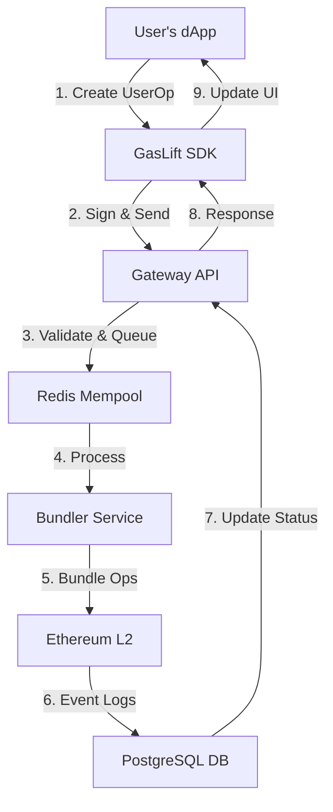

# GasLift ⛽🚀

## The Future of Gasless Transactions on Ethereum L2s

GasLift is a next-generation Account Abstraction infrastructure that eliminates gas fees for end-users, making blockchain applications as seamless as web2 experiences. Built specifically for Ethereum L2 ecosystems, GasLift enables dApps to sponsor transaction fees in a secure, scalable, and cost-effective manner.

## 🌟 Vision

Our mission is to onboard the next billion users to web3 by removing the complexities of blockchain transactions. GasLift envisions a future where:

- Users never need to think about gas fees or seed phrases
- dApps can abstract away blockchain complexities
- Developers can focus on building great products instead of wallet integrations
- Gas sponsorship becomes a standard growth tool for web3 applications

## 🏗️ Technical Architecture

### Core Components

1. **UniversalPaymaster (Smart Contracts)**
   - ERC-4337 compliant Paymaster contracts
   - Multi-token support with Chainlink price feeds
   - Gasless transaction verification and execution
   - Secure deposit/withdrawal mechanisms

2. **Bundler Service**
   - High-performance TypeScript implementation
   - Redis-backed mempool for operation batching
   - Multi-chain operation support
   - Automatic gas price optimization

3. **Gateway API**
   - RESTful and JSON-RPC endpoints
   - Rate limiting and API key management
   - Real-time operation status tracking
   - Webhook notifications

4. **SDK**
   - TypeScript-first developer experience
   - React hooks for frontend integration
   - Server-side utilities for backend services
   - Comprehensive type safety

### Data Flow



## 🚀 Why GasLift?

### For dApp Developers
- **Seamless Integration**: Add gasless transactions with <15 LOC
- **Multi-Chain Ready**: Deploy once, run on any EVM-compatible chain
- **Cost-Effective**: Optimized gas usage saves on transaction costs
- **Enterprise Grade**: Built with security and scalability in mind

### For End Users
- **No More Gas Fees**: Interact with dApps without holding native tokens
- **One-Click Transactions**: Simple, web2-like experience
- **Secure**: Non-custodial design ensures asset safety
- **Cross-Chain**: Unified experience across multiple L2s

## 🔮 Long-Term Vision

### Phase 1: Foundation (Now)
- Support for Base Sepolia and Optimism Sepolia testnets
- Basic paymaster functionality with USDC support
- Developer SDK with TypeScript and React bindings

### Phase 2: Mainnet Ready (Q3 2025)
- Mainnet deployment on Base and Optimism
- Advanced gas optimization algorithms
- Multi-wallet support (EIP-1271)
- Comprehensive monitoring and analytics

### Phase 3: Ecosystem Growth (2026)
- Support for additional L2s (Arbitrum, zkSync, etc.)
- On-ramp integration for easy fiat deposits
- Governance token and DAO for protocol upgrades
- Decentralized bundler network

## 🏗️ Project Structure

```
.
├── packages/
│   ├── contracts/      # Solidity contracts (Foundry)
│   ├── bundler/        # TypeScript bundler service
│   ├── gateway/        # Fastify API gateway
│   ├── sdk/            # TypeScript SDK for dApps
│   └── demo/           # Next.js demo application
├── docker/             # Docker configurations
└── .github/           # CI/CD workflows
```

## 🤝 Contributing

We're actively seeking contributors who are passionate about account abstraction and improving blockchain UX. Check out our [Contribution Guidelines](CONTRIBUTING.md) to get started.

## 📄 License

This project is licensed under the MIT License - see the [LICENSE](LICENSE) file for details.

## Development

### Prerequisites

- Node.js 18+
- pnpm 8.x
- Foundry (forge, cast)
- Docker & Docker Compose
- Redis 7
- Postgres 15

### Commands

```bash
# Install dependencies
pnpm install

# Run all tests
pnpm test

# Start development servers
pnpm dev

# Build all packages
pnpm build

# Lint code
pnpm lint
```

## License

MIT
